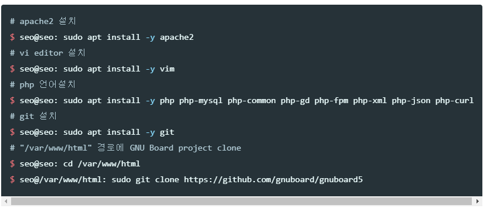

#### GNU Board 웹 서버 생성 
* * *
```bash
# apache2 설치
$ seo@seo: sudo apt install -y apache2
# vi editor 설치
$ seo@seo: sudo apt install -y vim
# php 언어설치
$ seo@seo: sudo apt install -y php php-mysql php-common php-gd php-fpm php-xml php-json php-curl
# git 설치
$ seo@seo: sudo apt install -y git
# "/var/www/html" 경로에 GNU Board project clone 
$ seo@seo: cd /var/www/html
$ seo@/var/www/html: sudo git clone https://github.com/gnuboard/gnuboard5
```
#### MySQL 데이터베이스, User 세팅
* * *
```sql
mysql > create user bts;
mysql > grant all privileages on bts
```

  

