#### Burp Suite 활용 Brute force 공격
1. metasploitable2 -> DVWA 에서 brute-force tab으로 이동
2. internet explorer 에서 proxy 허용 설정
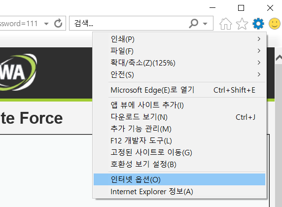  
3. 연결에서 LAN 설정
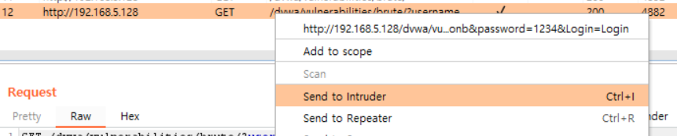  
4. 프록시 서버 아래와 같이 설정
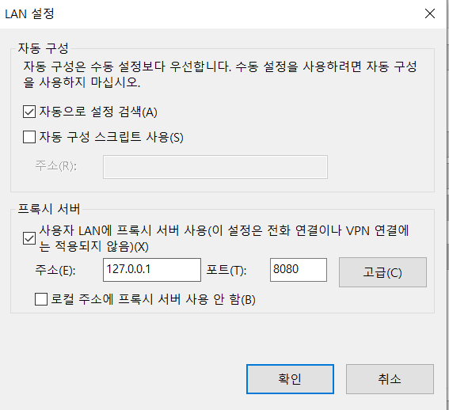  
5. brute-force 탭에서 타겟 user, password 아무렇게나 입력
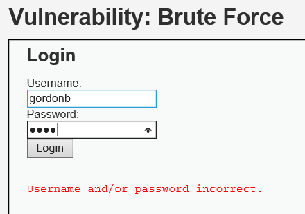  
6. burp suite proxy-> history 탭에서 방금 보낸 요청이 있는지 확인
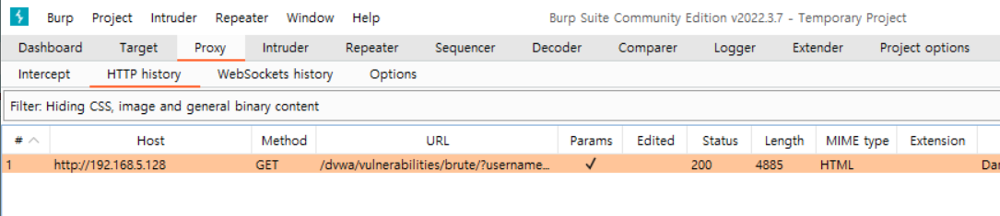  
7. 해당 히스토리를 선택 후 send to instruder
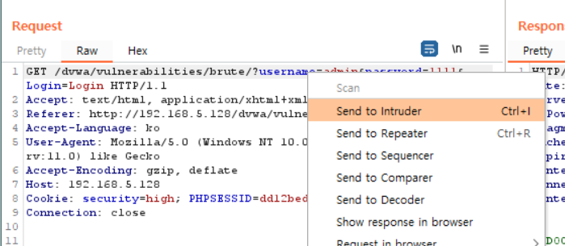  
8. 비밀번호 제외하고 모두 clear
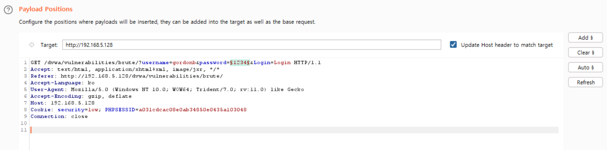
9. payload 탭으로 가서 dictionary를 load 하고 start
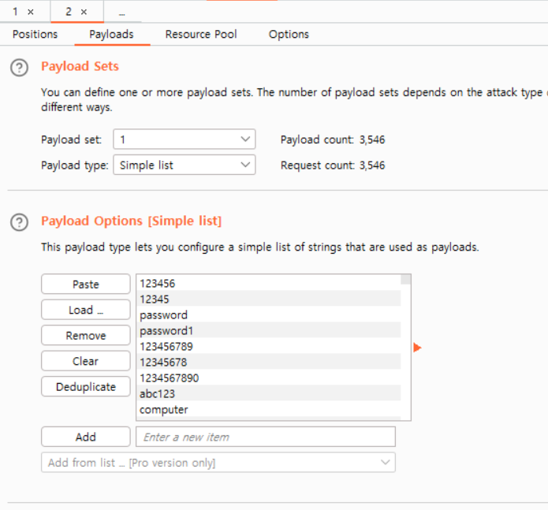  
- 패스워드를 찾아도 멈추지 않음
- 그렇다면 어떻게 구분할까?
- lengh 가 다름

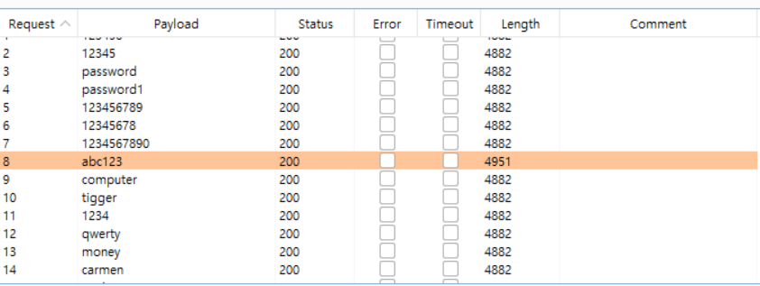  
- log 실시간으로 확인하는 법
- tail -f /var/log/apache2/access.log
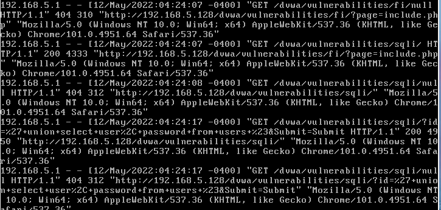
- brute-force 숫자로 하는 법
- admin 계정 비밀번호를 1234로 변경
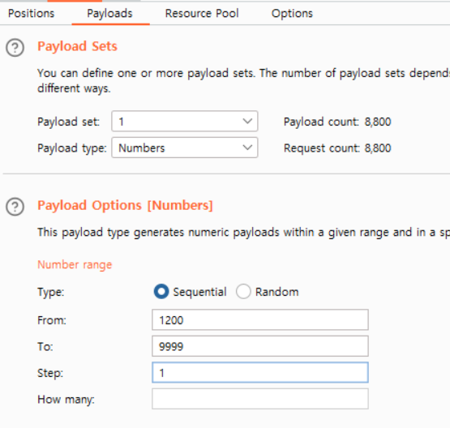  
- length 가 다른 request 확인
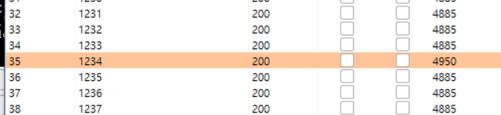  
